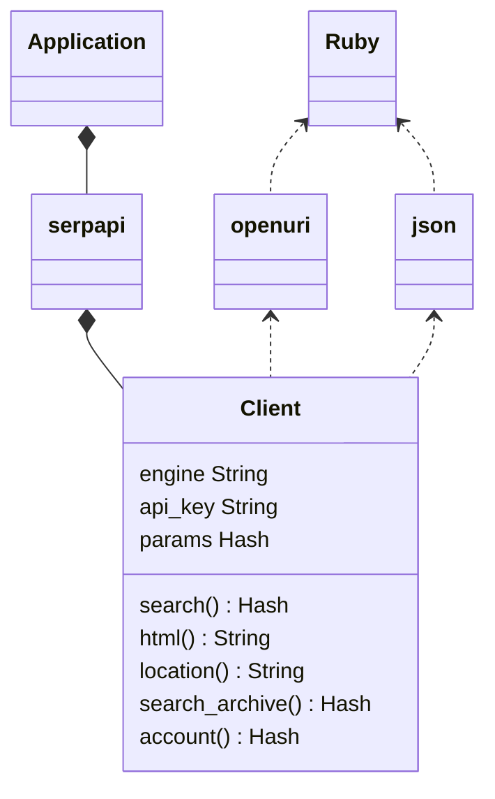
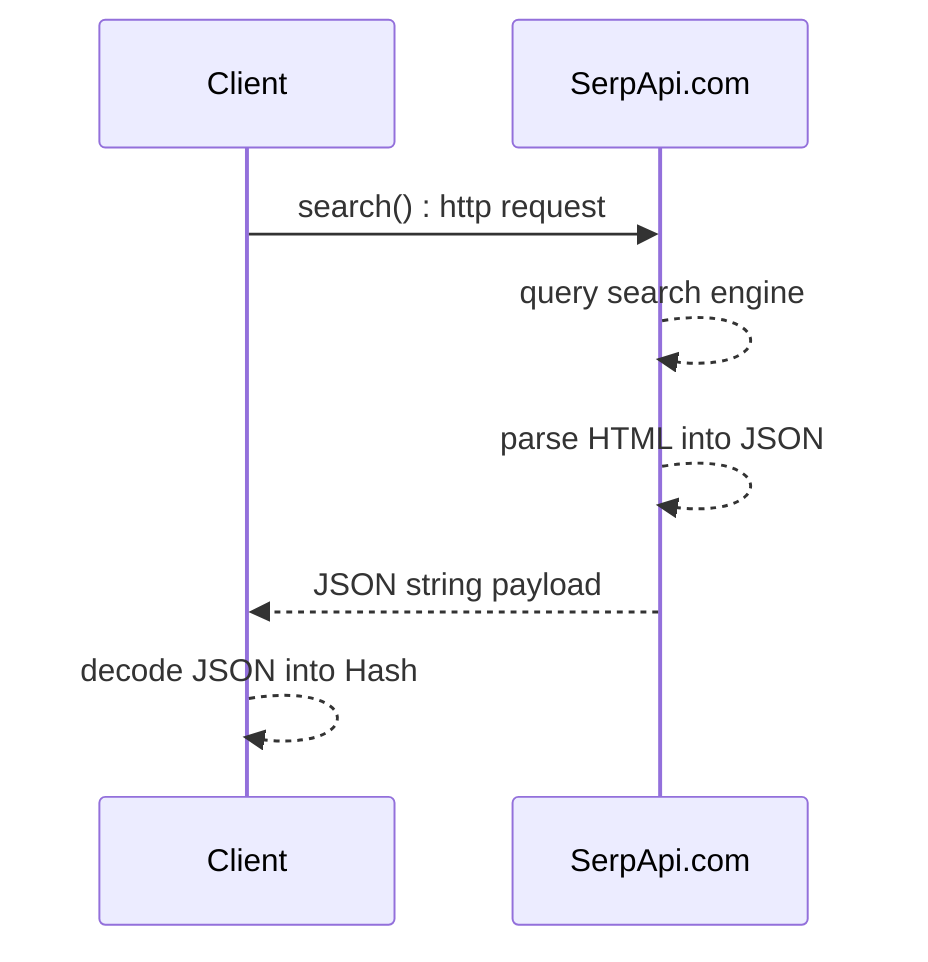

# serpapi-ruby : User Guide

Scrape any major search engine from our easy, fast, scalable and feature rich API powered [SerpApi](https://serpapi.com).

[](https://github.com/serpapi/serpapi-ruby/actions/workflows/ci.yml)
[](https://badge.fury.io/rb/serpapi)

SerpApi Gem allows unlimited searches from major search engines likes: Google, Bing, Baidu, Yandex, Yahoo, Ebay, Apple and more. The full list is available on [SerpApi](https://serpapi.com).

This library is a client for [SerpApi](https://serpapi.com).
[SerpApi](https://serpapi.com) is a highly scalable REST service over HTTP 1.1 that returns JSON or raw HTML results per search query. 

This library features:
 - Tons of pratical examples.
 - Encode parameters into HTTP request.
 - Decode HTTP response JSON payload into a Hash using Ruby's 'json' standard library.
 - Expose one Ruby method per service end point: search, account, html, search_archive, location)
 - Adds a simple error handling by throwing SerpApiException.


## Installation

Ruby >= 2.6 must be already installed.

### Bundler
```ruby
gem 'serpapi', '~> 1.0.0'
```

### Gem 
```bash
$ gem install serpapi
```

[Link to the gem page](https://rubygems.org/gems/serpapi/)

[API documentation](https://rubydoc.info/github/serpapi/serpapi-ruby/master)

## Quick start

Let's run a search on Google about Coffee.

```ruby
require 'serpapi'
client = SerpApi::Client.new(engine: 'google', api_key: "secret_api_key")
results = client.search(q: "coffee")
pp results

# oneliner option: all parameters are in the search method argument.
pp SerpApi::Client.new.search(q: "coffee", engine: 'google', api_key: "secret_api_key")
 ```

This example runs a search about "coffee" using your `secret_api_key`
 then returns the results as a dynamic Hash.

The SerpApi.com service (backend)
 - executes a scalable search on `engine: "google"` using the search query: `q: "coffee"`.
 - parses the messy HTML responses from Google on the backend.
 - returns a standardized JSON response.
The class SerpApi::Client (client side / ruby):
 - Format the request to SerpApi.com server.
 - Execute HTTP Get request.
 - Parse JSON into Ruby Hash using standard JSON library.
Et voila...

See the [playground to generate your code.](https://serpapi.com/playground)

## API Guide
### Search API overview
```ruby
# load gem
require 'serpapi'

# serpapi client initialization with default parameter
client = SerpApi::Client.new(api_key: "secret_key")
# We recommend that you keep your keys safe.
# At least, don't commit them in plain text.
# More about configuration via environment variables: https://12factor.net/config

# search query overview (more fields available depending on search engine)
params = {
  engine: "google",   # full list: https://serpapi.com/search-api
  q: "client",
  google_domain: "Google Domain",
  location: "Location Requested", # example: Portland,Oregon,United States [see: Location API](#Location-API)
  device: "desktop|mobile|tablet",
  hl: "Google UI Language",
  gl: "Google Country",
  safe: "Safe Search Flag",
  num: "Number of Results",
  start: "Pagination Offset",
  tbm: "nws|isch|shop",
  tbs: "custom to be client criteria",
  async: false # true when async call enabled.
}

# formated search results as a Hash
#  serpapi.com converts HTML -> JSON 
results = client.search(params)

# raw search engine html as a String
#  serpapi.com acts a proxy to provive high throughputs, no search limit and more.
raw_html = client.html(parameter)
```

[The full documentation](https://serpapi.com/search-api).
More hand on examples are available below.

### Location API

```ruby
require 'serpapi'
client = SerpApi::Client.new() 
location_list = client.location(q: "Austin", limit: 3)
puts "number of location: #{location_list.size}"
pp location_list
```

it prints the first 3 locations matching Austin (Texas, Texas, Rochester)
```ruby
[{
  :id=>"585069bdee19ad271e9bc072",
  :google_id=>200635,
  :google_parent_id=>21176,
  :name=>"Austin, TX",
  :canonical_name=>"Austin,TX,Texas,United States",
  :country_code=>"US",
  :target_type=>"DMA Region",
  :reach=>5560000,
  :gps=>[-97.7430608, 30.267153],
  :keys=>["austin", "tx", "texas", "united", "states"]
  }
  # ...
]
```

NOTE: api_key is not required for this endpoint.

### Search Archive API

This API allows retrieving previous search results.
To fetch previous results from the search_id.
```ruby
require 'serpapi'
client = SerpApi::Client.new(api_key: 'secret_api_key', engine: 'google')
results = client.search(q: "Coffee", location: "Portland")
search_id = results[:search_metadata][:id]
```

Now let's retrieve the previous search results from the archive.

```ruby
require 'serpapi'
client = SerpApi::Client.new(api_key: 'secret_api_key')
results = client.search_archive(search_id)
pp results
```

This code prints the search results from the archive. :)

### Account API
```ruby
require 'serpapi'
client = SerpApi::Client.new(api_key: 'secret_api_key')
pp client.account
```

It prints your account information.

## Basic example per search engine

### Search bing
```ruby
require 'serpapi'
client = SerpApi::Client.new(api_key: ENV['API_KEY'], engine: 'bing')
results = client.search({
  "q": "coffee"
})
pp results[:organic_results]
# ENV['API_KEY'] captures the secret user API available from http://serpapi.com
```

 * source code: [spec/serpapi/example_search_bing_spec.rb](https://github.com/serpapi/serpapi-ruby/blob/master/spec/serpapi/example_search_bing_spec.rb)
 * doc: [https://serpapi.com/bing-search-api](https://serpapi.com/bing-search-api)

### Search baidu
```ruby
require 'serpapi'
client = SerpApi::Client.new(api_key: ENV['API_KEY'], engine: 'baidu')
results = client.search({
  "q": "coffee"
})
pp results[:organic_results]
# ENV['API_KEY'] captures the secret user API available from http://serpapi.com
```

 * source code: [spec/serpapi/example_search_baidu_spec.rb](https://github.com/serpapi/serpapi-ruby/blob/master/spec/serpapi/example_search_baidu_spec.rb)
 * doc: [https://serpapi.com/baidu-search-api](https://serpapi.com/baidu-search-api)

### Search yahoo
```ruby
require 'serpapi'
client = SerpApi::Client.new(api_key: ENV['API_KEY'], engine: 'yahoo')
results = client.search({
  "p": "coffee"
})
pp results[:organic_results]
# ENV['API_KEY'] captures the secret user API available from http://serpapi.com
```

 * source code: [spec/serpapi/example_search_yahoo_spec.rb](https://github.com/serpapi/serpapi-ruby/blob/master/spec/serpapi/example_search_yahoo_spec.rb)
 * doc: [https://serpapi.com/yahoo-search-api](https://serpapi.com/yahoo-search-api)

### Search youtube
```ruby
require 'serpapi'
client = SerpApi::Client.new(api_key: ENV['API_KEY'], engine: 'youtube')
results = client.search({
  "search_query": "coffee"
})
pp results[:video_results]
# ENV['API_KEY'] captures the secret user API available from http://serpapi.com
```

 * source code: [spec/serpapi/example_search_youtube_spec.rb](https://github.com/serpapi/serpapi-ruby/blob/master/spec/serpapi/example_search_youtube_spec.rb)
 * doc: [https://serpapi.com/youtube-search-api](https://serpapi.com/youtube-search-api)

### Search walmart
```ruby
require 'serpapi'
client = SerpApi::Client.new(api_key: ENV['API_KEY'], engine: 'walmart')
results = client.search({
  "query": "coffee"
})
pp results[:organic_results]
# ENV['API_KEY'] captures the secret user API available from http://serpapi.com
```

 * source code: [spec/serpapi/example_search_walmart_spec.rb](https://github.com/serpapi/serpapi-ruby/blob/master/spec/serpapi/example_search_walmart_spec.rb)
 * doc: [https://serpapi.com/walmart-search-api](https://serpapi.com/walmart-search-api)

### Search ebay
```ruby
require 'serpapi'
client = SerpApi::Client.new(api_key: ENV['API_KEY'], engine: 'ebay')
results = client.search({
  "_nkw": "coffee"
})
pp results[:organic_results]
# ENV['API_KEY'] captures the secret user API available from http://serpapi.com
```

 * source code: [spec/serpapi/example_search_ebay_spec.rb](https://github.com/serpapi/serpapi-ruby/blob/master/spec/serpapi/example_search_ebay_spec.rb)
 * doc: [https://serpapi.com/ebay-search-api](https://serpapi.com/ebay-search-api)

### Search naver
```ruby
require 'serpapi'
client = SerpApi::Client.new(api_key: ENV['API_KEY'], engine: 'naver')
results = client.search({
  "query": "coffee"
})
pp results[:ads_results]
# ENV['API_KEY'] captures the secret user API available from http://serpapi.com
```

 * source code: [spec/serpapi/example_search_naver_spec.rb](https://github.com/serpapi/serpapi-ruby/blob/master/spec/serpapi/example_search_naver_spec.rb)
 * doc: [https://serpapi.com/naver-search-api](https://serpapi.com/naver-search-api)

### Search home depot
```ruby
require 'serpapi'
client = SerpApi::Client.new(api_key: ENV['API_KEY'], engine: 'home_depot')
results = client.search({
  "q": "table"
})
pp results[:products]
# ENV['API_KEY'] captures the secret user API available from http://serpapi.com
```

 * source code: [spec/serpapi/example_search_home_depot_spec.rb](https://github.com/serpapi/serpapi-ruby/blob/master/spec/serpapi/example_search_home_depot_spec.rb)
 * doc: [https://serpapi.com/home-depot-search-api](https://serpapi.com/home-depot-search-api)

### Search apple app store
```ruby
require 'serpapi'
client = SerpApi::Client.new(api_key: ENV['API_KEY'], engine: 'apple_app_store')
results = client.search({
  "term": "coffee"
})
pp results[:organic_results]
# ENV['API_KEY'] captures the secret user API available from http://serpapi.com
```

 * source code: [spec/serpapi/example_search_apple_app_store_spec.rb](https://github.com/serpapi/serpapi-ruby/blob/master/spec/serpapi/example_search_apple_app_store_spec.rb)
 * doc: [https://serpapi.com/apple-app-store](https://serpapi.com/apple-app-store)

### Search duckduckgo
```ruby
require 'serpapi'
client = SerpApi::Client.new(api_key: ENV['API_KEY'], engine: 'duckduckgo')
results = client.search({
  "q": "coffee"
})
pp results[:organic_results]
# ENV['API_KEY'] captures the secret user API available from http://serpapi.com
```

 * source code: [spec/serpapi/example_search_duckduckgo_spec.rb](https://github.com/serpapi/serpapi-ruby/blob/master/spec/serpapi/example_search_duckduckgo_spec.rb)
 * doc: [https://serpapi.com/duckduckgo-search-api](https://serpapi.com/duckduckgo-search-api)

### Search google search
```ruby
require 'serpapi'
client = SerpApi::Client.new(api_key: ENV['API_KEY'], engine: 'google_search')
results = client.search({
  "q": "coffee",
  "engine": "google"
})
pp results[:organic_results]
# ENV['API_KEY'] captures the secret user API available from http://serpapi.com
```

 * source code: [spec/serpapi/example_search_google_search_spec.rb](https://github.com/serpapi/serpapi-ruby/blob/master/spec/serpapi/example_search_google_search_spec.rb)
 * doc: [https://serpapi.com/search-api](https://serpapi.com/search-api)

### Search google scholar
```ruby
require 'serpapi'
client = SerpApi::Client.new(api_key: ENV['API_KEY'], engine: 'google_scholar')
results = client.search({
  "q": "coffee"
})
pp results[:organic_results]
# ENV['API_KEY'] captures the secret user API available from http://serpapi.com
```

 * source code: [spec/serpapi/example_search_google_scholar_spec.rb](https://github.com/serpapi/serpapi-ruby/blob/master/spec/serpapi/example_search_google_scholar_spec.rb)
 * doc: [https://serpapi.com/google-scholar-api](https://serpapi.com/google-scholar-api)

### Search google autocomplete
```ruby
require 'serpapi'
client = SerpApi::Client.new(api_key: ENV['API_KEY'], engine: 'google_autocomplete')
results = client.search({
  "q": "coffee"
})
pp results[:suggestions]
# ENV['API_KEY'] captures the secret user API available from http://serpapi.com
```

 * source code: [spec/serpapi/example_search_google_autocomplete_spec.rb](https://github.com/serpapi/serpapi-ruby/blob/master/spec/serpapi/example_search_google_autocomplete_spec.rb)
 * doc: [https://serpapi.com/google-autocomplete-api](https://serpapi.com/google-autocomplete-api)

### Search google product
```ruby
require 'serpapi'
client = SerpApi::Client.new(api_key: ENV['API_KEY'], engine: 'google_product')
results = client.search({
  "q": "coffee",
  "product_id": "4172129135583325756"
})
pp results[:product_results]
# ENV['API_KEY'] captures the secret user API available from http://serpapi.com
```

 * source code: [spec/serpapi/example_search_google_product_spec.rb](https://github.com/serpapi/serpapi-ruby/blob/master/spec/serpapi/example_search_google_product_spec.rb)
 * doc: [https://serpapi.com/google-product-api](https://serpapi.com/google-product-api)

### Search google reverse image
```ruby
require 'serpapi'
client = SerpApi::Client.new(api_key: ENV['API_KEY'], engine: 'google_reverse_image')
results = client.search({
  "image_url": "https://i.imgur.com/5bGzZi7.jpg"
})
pp results[:image_sizes]
# ENV['API_KEY'] captures the secret user API available from http://serpapi.com
```

 * source code: [spec/serpapi/example_search_google_reverse_image_spec.rb](https://github.com/serpapi/serpapi-ruby/blob/master/spec/serpapi/example_search_google_reverse_image_spec.rb)
 * doc: [https://serpapi.com/google-reverse-image](https://serpapi.com/google-reverse-image)

### Search google events
```ruby
require 'serpapi'
client = SerpApi::Client.new(api_key: ENV['API_KEY'], engine: 'google_events')
results = client.search({
  "q": "coffee"
})
pp results[:events_results]
# ENV['API_KEY'] captures the secret user API available from http://serpapi.com
```

 * source code: [spec/serpapi/example_search_google_events_spec.rb](https://github.com/serpapi/serpapi-ruby/blob/master/spec/serpapi/example_search_google_events_spec.rb)
 * doc: [https://serpapi.com/google-events-api](https://serpapi.com/google-events-api)

### Search google local services
```ruby
require 'serpapi'
client = SerpApi::Client.new(api_key: ENV['API_KEY'], engine: 'google_local_services')
results = client.search({
  "q": "Electrician",
  "place_id": "ChIJOwg_06VPwokRYv534QaPC8g"
  })
pp results[:local_ads]
# ENV['API_KEY'] captures the secret user API available from http://serpapi.com
```

 * source code: [spec/serpapi/example_search_google_local_services_spec.rb](https://github.com/serpapi/serpapi-ruby/blob/master/spec/serpapi/example_search_google_local_services_spec.rb)
 * doc: [https://serpapi.com/google-local-services-api](https://serpapi.com/google-local-services-api)

### Search google maps
```ruby
require 'serpapi'
client = SerpApi::Client.new(api_key: ENV['API_KEY'], engine: 'google_maps')
results = client.search({
  "q": "pizza",
  "ll": "@40.7455096,-74.0083012,15.1z",
  "type": "search"
})
pp results[:local_results]
# ENV['API_KEY'] captures the secret user API available from http://serpapi.com
```

 * source code: [spec/serpapi/example_search_google_maps_spec.rb](https://github.com/serpapi/serpapi-ruby/blob/master/spec/serpapi/example_search_google_maps_spec.rb)
 * doc: [https://serpapi.com/google-maps-api](https://serpapi.com/google-maps-api)

### Search google jobs
```ruby
require 'serpapi'
client = SerpApi::Client.new(api_key: ENV['API_KEY'], engine: 'google_jobs')
results = client.search({
  "q": "coffee"
})
pp results[:jobs_results]
# ENV['API_KEY'] captures the secret user API available from http://serpapi.com
```

 * source code: [spec/serpapi/example_search_google_jobs_spec.rb](https://github.com/serpapi/serpapi-ruby/blob/master/spec/serpapi/example_search_google_jobs_spec.rb)
 * doc: [https://serpapi.com/google-jobs-api](https://serpapi.com/google-jobs-api)

### Search google play
```ruby
require 'serpapi'
client = SerpApi::Client.new(api_key: ENV['API_KEY'], engine: 'google_play')
results = client.search({
  "q": "kite",
  "store": "apps"
})
pp results[:organic_results]
# ENV['API_KEY'] captures the secret user API available from http://serpapi.com
```

 * source code: [spec/serpapi/example_search_google_play_spec.rb](https://github.com/serpapi/serpapi-ruby/blob/master/spec/serpapi/example_search_google_play_spec.rb)
 * doc: [https://serpapi.com/google-play-api](https://serpapi.com/google-play-api)

### Search google images
```ruby
require 'serpapi'
client = SerpApi::Client.new(api_key: ENV['API_KEY'], engine: 'google_images')
results = client.search({
  "engine": "google",
  "tbm": "isch",
  "q": "coffee"
})
pp results[:images_results]
# ENV['API_KEY'] captures the secret user API available from http://serpapi.com
```

 * source code: [spec/serpapi/example_search_google_images_spec.rb](https://github.com/serpapi/serpapi-ruby/blob/master/spec/serpapi/example_search_google_images_spec.rb)
 * doc: [https://serpapi.com/images-results](https://serpapi.com/images-results)

## Advanced search API usage
### Highly scalable batching

Search API features non-blocking search using the option: `async=true`.
 - Non-blocking - async=true - a single parent process can handle an unlimited amount of concurrent searches.
 - Blocking - async=false - many processes must be forked and synchronized to handle concurrent searches. this strategy is compute-intensive mostly I/O usage because each client would hold a network connection.

Search API enables `async` search.
 - Non-blocking (`async=true`) : the development is more complex but this allows to handle many simultaneous connections.
 - Blocking (`async=false`) : it's easy to write the code but more compute-intensive when the parent process needs to hold many connections.

Here is an example of asynchronous searches using Ruby 
```ruby
require 'serpapi'
# target MAANG companies
company_list = %w(meta amazon apple netflix google)
client = SerpApi::Client.new({engine: 'google', async: true, api_key: 'secret_api_key'})
search_queue = Queue.new
company_list.each do |company|
  # set client
  client.params[:q] = company

  # store request into a search_queue - no-blocker
  result = client.search()
  if result[:search_metadata][:status] =~ /Cached|Success/
    puts "#{company}: client done"
    next
  end

  # add results to the client queue
  search_queue.push(result)
end

puts "wait until all searches are cached or success"
while !search_queue.empty?
  result = search_queue.pop
  # extract client id
  search_id = result[:search_metadata][:id]

  # retrieve client from the archive - blocker
  search_archived = client.search_archive(search_id)
  if search_archived[:search_metadata][:status] =~ /Cached|Success/
    puts "#{search_archived[:search_parameters][:q]}: client done"
    next
  end

  # add results to the client queue
  search_queue.push(result)
end

search_queue.close
puts 'all searches completed'
```

This code shows a simple solution to batch searches asynchronous.
This example relies on the fact that the search is slow
 while fetching the search results from the archive is expensive. 
It can take a few seconds for the search to be completed.

## Supported Ruby version.
Ruby versions validated by Github Actions:
 - 3.1
 - 2.6
see: [Github Actions.](https://github.com/serpapi/serpapi-ruby/actions/workflows/ci.yml)

## Change log
 * [2022-03-20] 1.0.0 Full API support

## Developer Guide
### Key goals
 - Brand centric instead of search engine based
   - No hard-coded logic per search engine
 - Simple HTTP client (lightweight, reduced dependency)
   - No magic default values
   - Thread safe
 - Easy extension
 - Defensive code style (raise custom exception)
 - TDD
 - Best API coding practice per platform
 - KiSS principles

### Inspirations
This project source code and coding style was inspired by the most awesome Ruby Gems:
 - [https://github.com/bcrypt-ruby/bcrypt-ruby]
 - Nokogiri
 - Cloudfare
 - rest-client
 - stripe-ruby
 
### Quality expectations
 - 0 lint offense: `make lint`
 - 100% tests passing: `make test`
 - 100% code coverage: `make test` (simple-cov)

# Developer Guide
## Design : UML diagram

## search() : Sequence diagram

where:
  - Application is created by end user.
  - Client refers to SerpApi:Client.
  - SerpApi.com is the backend REST service.
  - Engine like Google, Baidu, Bing and more...

## Continuous integration
We love true open source, continuous integration and Test Drive Development (TDD).
 We are using RSpec to test [our infrastructure around the clock]) using Github Action to achieve the best QoS (Quality Of Service).

The directory spec/ includes specification which serves the dual purposes of examples and functional tests.

Set your API Key to allow the tests to run.
```bash
export API_KEY="your_secret_key"
```
Install testing dependency
```bash
$ bundle install
# or
$ rake dependency
```

Check code quality using Lint.
```bash
$ rake lint
```

Run regression.
```bash
$ rake test
```

To flush the flow.
```bash
$ rake
```

Open ./Rakefile for more information.

Contributions are welcome, feel to submit a pull request!

# TODO
 - [] Release version 1.0.0