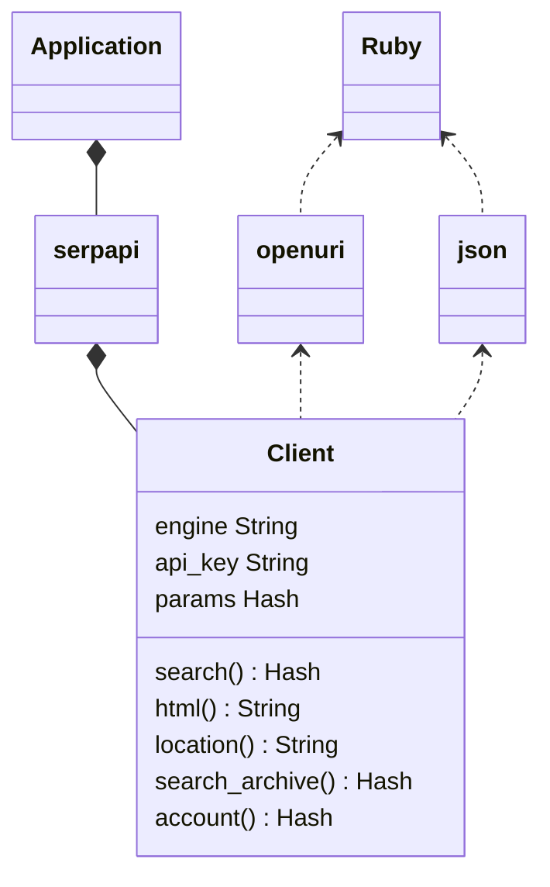
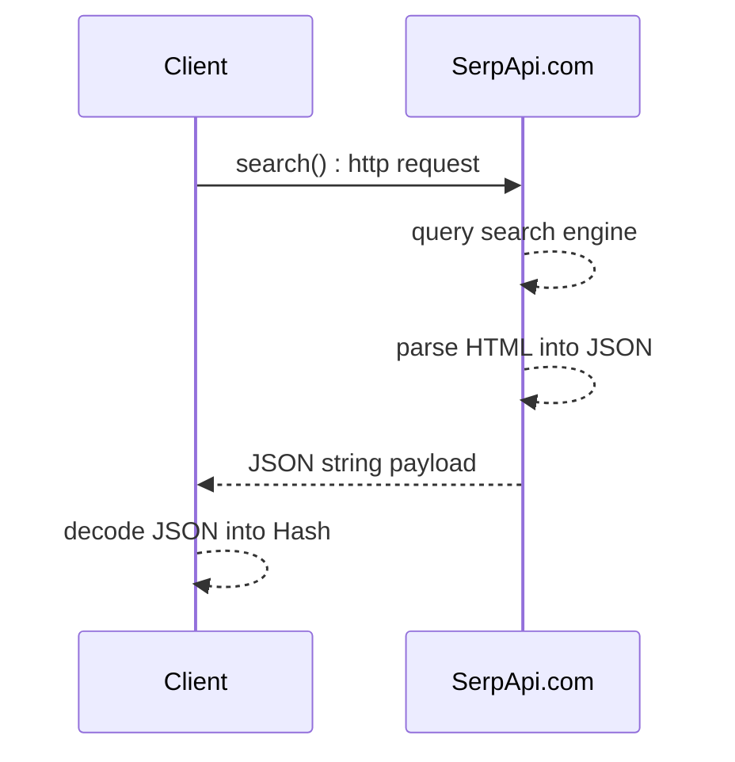

<div align="center">
<h1 align="center">SerpApi Ruby Library</h1>


[](https://badge.fury.io/rb/serpapi) [](https://github.com/serpapi/serpapi-ruby/actions/workflows/ci.yml)  [](https://github.com/serpapi/serpapi-ruby/actions/workflows/sanity_alt.yml) [](https://github.com/serpapi/serpapi-ruby/actions/workflows/sanity_1.yml) [](https://github.com/serpapi/serpapi-ruby/actions/workflows/sanity_2.yml)
</div>

Integrate search data into your Ruby application. This library is the official wrapper for SerpApi (https://serpapi.com).

SerpApi supports Google, Google Maps, Google Shopping, Baidu, Yandex, Yahoo, eBay, App Stores, and more.

## Installation

Ruby 3+ must be installed for best performance the latest version 3.4 is recommended.
 For older version of Ruby 1.9 and 2.x or JRuby, our older library is still functional.

### Bundler
```ruby
gem 'serpapi', '~> 1.0.0'
```

### Gem 
```bash
$ gem install serpapi
```

[Ruby Gem page](https://rubygems.org/gems/serpapi/)

## Simple Usage

```ruby
require 'serpapi'
client = SerpApi::Client.new api_key: "serpapi_api_key"
results = client.search q: "coffee", engine: "google"
pp results
 ```

This example runs a search for "coffee" on Google. It then returns the results as a regular Ruby Hash. See the [playground](https://serpapi.com/playground) to generate your own code.

## Advanced Usage
### Search API
```ruby
# load gem
require 'serpapi'

# serpapi client created with default parameters
client = SerpApi::Client.new(api_key: "secret_key", engine: "google")

# We recommend that you keep your keys safe.
# At least, don't commit them in plain text.
# More about configuration via environment variables: 
# https://hackernoon.com/all-the-secrets-of-encrypting-api-keys-in-ruby-revealed-5qf3t5l

# search query overview (more fields available depending on search engine)
params = {
  # select the search engine (full list: https://serpapi.com/)
  engine: "google",
  # actual search query
  q: "Coffee",
  # then adds search engine specific options.
  # for example: google specific parameters: https://serpapi.com/search-api
  google_domain: "Google Domain",
  location: "Location Requested", # example: Portland,Oregon,United States [ * doc: Location API](#Location-API)
  device: "desktop|mobile|tablet",
  hl: "Google UI Language",
  gl: "Google Country",
  safe: "Safe Search Flag",
  num: "Number of Results",
  start: "Pagination Offset",
  tbm: "nws|isch|shop",
  tbs: "custom to be client criteria",
  # tweak HTTP client behavior
  async: false, # true when async call enabled.
  timeout: 60, # HTTP timeout in seconds on the client side only.
}

# formated search results as a Hash
#  serpapi.com converts HTML -> JSON 
results = client.search(params)

# raw search engine html as a String
#  serpapi.com acts a proxy to provive high throughputs, no search limit and more.
raw_html = client.html(parameter)
```

[Google search documentation](https://serpapi.com/search-api).
More hands on examples are available below.

#### Documentations

 * [API documentation](https://rubydoc.info/github/serpapi/serpapi-ruby/master)
 * [Full documentation on SerpApi.com](https://serpapi.com)
 * [Library Github page](https://github.com/serpapi/serpapi-ruby)
 * [Library GEM page](https://rubygems.org/gems/serpapi/)
 * [API health status](https://serpapi.com/status)

### Location API

```ruby
require 'serpapi'
client = SerpApi::Client.new() 
location_list = client.location(q: "Austin", limit: 3)
puts "number of location: #{location_list.size}"
pp location_list
```

it prints the first 3 locations matching Austin (Texas, Texas, Rochester)
```ruby
[{
  :id=>"585069bdee19ad271e9bc072",
  :google_id=>200635,
  :google_parent_id=>21176,
  :name=>"Austin, TX",
  :canonical_name=>"Austin,TX,Texas,United States",
  :country_code=>"US",
  :target_type=>"DMA Region",
  :reach=>5560000,
  :gps=>[-97.7430608, 30.267153],
  :keys=>["austin", "tx", "texas", "united", "states"]
  }
  # ...
]
```

NOTE: api_key is not required for this endpoint.

### Search Archive API

This API allows retrieving previous search results.
To fetch earlier results from the search_id.

First, you need to run a search and save the search id.
```ruby
require 'serpapi'
client = SerpApi::Client.new(api_key: 'secret_api_key', engine: 'google')
results = client.search(q: "Coffee", location: "Portland")
search_id = results[:search_metadata][:id]
```

Now let's retrieve the previous search results from the archive.

```ruby
require 'serpapi'
client = SerpApi::Client.new(api_key: 'secret_api_key')
results = client.search_archive(search_id)
pp results
```

This code prints the search results from the archive. :)

### Account API
```ruby
require 'serpapi'
client = SerpApi::Client.new(api_key: 'secret_api_key')
pp client.account
```

It prints your account information.

### Change HTTP client implementation

The internal HTTP client is based on the [Faraday](https://lostisland.github.io/faraday/) library.
 You can change the HTTP client by passing the adapter as an argument to the `SerpApi::Client.new` method.

It requires to install the adapter gem.
```sh
gem install faraday-httpclient
```

```ruby
# see faraday documentation for adapter description.
client = SerpApi::Client.new(engine: 'google', api_key: ENV['API_KEY'], timeout: 10, adapter: :httpclient)
data = client.search(q: 'Coffee', location: 'Austin, TX')
pp data
```

## Basic example per search engine

Here is how to calls the APIs.

### Search google
```ruby
require 'serpapi'
# initialize the serp api client
client = SerpApi::Client.new(engine: 'google', api_key: ENV['API_KEY'])
# run a search using serpapi service
results = client.search({
  q: 'coffee'
})

# print the output of the response in formatted JSON
pp results[:organic_results]
# doc: https://serpapi.com/google
```

 * source code: [spec/serpapi/client/example/example_search_google_spec.rb](https://github.com/serpapi/serpapi-ruby/blob/master/spec/serpapi/client/example/example_search_google_spec.rb)
 * doc: [https://serpapi.com/search-api](https://serpapi.com/search-api)

### Search google scholar
```ruby
require 'serpapi'
# initialize the serp api client
client = SerpApi::Client.new(engine: 'google_scholar', api_key: ENV['API_KEY'])
# run a search using serpapi service
results = client.search({
  q: 'biology'
})

# print the output of the response in formatted JSON
pp results[:organic_results]
# doc: https://serpapi.com/google_scholar
```

 * source code: [spec/serpapi/client/example/example_search_google_scholar_spec.rb](https://github.com/serpapi/serpapi-ruby/blob/master/spec/serpapi/client/example/example_search_google_scholar_spec.rb)
 * doc: [https://serpapi.com/google-scholar-api](https://serpapi.com/google-scholar-api)

### Search google autocomplete
```ruby
require 'serpapi'
# initialize the serp api client
client = SerpApi::Client.new(engine: 'google_autocomplete', api_key: ENV['API_KEY'])
# run a search using serpapi service
results = client.search({
  q: 'coffee'
})

# print the output of the response in formatted JSON
pp results[:suggestions]
# doc: https://serpapi.com/google_autocomplete
```

 * source code: [spec/serpapi/client/example/example_search_google_autocomplete_spec.rb](https://github.com/serpapi/serpapi-ruby/blob/master/spec/serpapi/client/example/example_search_google_autocomplete_spec.rb)
 * doc: [https://serpapi.com/google-autocomplete-api](https://serpapi.com/google-autocomplete-api)

### Search google product
```ruby
require 'serpapi'
# initialize the serp api client
client = SerpApi::Client.new(engine: 'google_product', api_key: ENV['API_KEY'])
# run a search using serpapi service
results = client.search({
  q: 'coffee',
  product_id: '4887235756540435899'
})

# print the output of the response in formatted JSON
pp results[:product_results]
# doc: https://serpapi.com/google_product
```

 * source code: [spec/serpapi/client/example/example_search_google_product_spec.rb](https://github.com/serpapi/serpapi-ruby/blob/master/spec/serpapi/client/example/example_search_google_product_spec.rb)
 * doc: [https://serpapi.com/google-product-api](https://serpapi.com/google-product-api)

### Search google reverse image
```ruby
require 'serpapi'
# initialize the serp api client
client = SerpApi::Client.new(engine: 'google_reverse_image', api_key: ENV['API_KEY'])
# run a search using serpapi service
results = client.search({
  image_url: 'https://i.imgur.com/5bGzZi7.jpg'
})

# print the output of the response in formatted JSON
pp results[:image_sizes]
# doc: https://serpapi.com/google_reverse_image
```

 * source code: [spec/serpapi/client/example/example_search_google_reverse_image_spec.rb](https://github.com/serpapi/serpapi-ruby/blob/master/spec/serpapi/client/example/example_search_google_reverse_image_spec.rb)
 * doc: [https://serpapi.com/google-reverse-image](https://serpapi.com/google-reverse-image)

### Search google events
```ruby
require 'serpapi'
# initialize the serp api client
client = SerpApi::Client.new(engine: 'google_events', api_key: ENV['API_KEY'])
# run a search using serpapi service
results = client.search({
  q: 'coffee'
})

# print the output of the response in formatted JSON
pp results[:events_results]
# doc: https://serpapi.com/google_events
```

 * source code: [spec/serpapi/client/example/example_search_google_events_spec.rb](https://github.com/serpapi/serpapi-ruby/blob/master/spec/serpapi/client/example/example_search_google_events_spec.rb)
 * doc: [https://serpapi.com/google-events-api](https://serpapi.com/google-events-api)

### Search google local services
```ruby
require 'serpapi'
# initialize the serp api client
client = SerpApi::Client.new(engine: 'google_local_services', api_key: ENV['API_KEY'])
# run a search using serpapi service
results = client.search({
  q: 'electrician',
  data_cid: '6745062158417646970'
})

# print the output of the response in formatted JSON
pp results[:local_ads]
# doc: https://serpapi.com/google_local_services
```

 * source code: [spec/serpapi/client/example/example_search_google_local_services_spec.rb](https://github.com/serpapi/serpapi-ruby/blob/master/spec/serpapi/client/example/example_search_google_local_services_spec.rb)
 * doc: [https://serpapi.com/google-local-services-api](https://serpapi.com/google-local-services-api)

### Search google maps
```ruby
require 'serpapi'
# initialize the serp api client
client = SerpApi::Client.new(engine: 'google_maps', api_key: ENV['API_KEY'])
# run a search using serpapi service
results = client.search({
  q: 'Coffee',
  ll: '@40.7455096,-74.0083012,14z',
  type: 'search'
})

# print the output of the response in formatted JSON
pp results[:local_results]
# doc: https://serpapi.com/google_maps
```

 * source code: [spec/serpapi/client/example/example_search_google_maps_spec.rb](https://github.com/serpapi/serpapi-ruby/blob/master/spec/serpapi/client/example/example_search_google_maps_spec.rb)
 * doc: [https://serpapi.com/google-maps-api](https://serpapi.com/google-maps-api)

### Search google jobs
```ruby
require 'serpapi'
# initialize the serp api client
client = SerpApi::Client.new(engine: 'google_jobs', api_key: ENV['API_KEY'])
# run a search using serpapi service
results = client.search({
  q: 'coffee'
})

# print the output of the response in formatted JSON
pp results[:jobs_results]
# doc: https://serpapi.com/google_jobs
```

 * source code: [spec/serpapi/client/example/example_search_google_jobs_spec.rb](https://github.com/serpapi/serpapi-ruby/blob/master/spec/serpapi/client/example/example_search_google_jobs_spec.rb)
 * doc: [https://serpapi.com/google-jobs-api](https://serpapi.com/google-jobs-api)

### Search google play
```ruby
require 'serpapi'
# initialize the serp api client
client = SerpApi::Client.new(engine: 'google_play', api_key: ENV['API_KEY'])
# run a search using serpapi service
results = client.search({
  q: 'kite',
  store: 'apps'
})

# print the output of the response in formatted JSON
pp results[:organic_results]
# doc: https://serpapi.com/google_play
```

 * source code: [spec/serpapi/client/example/example_search_google_play_spec.rb](https://github.com/serpapi/serpapi-ruby/blob/master/spec/serpapi/client/example/example_search_google_play_spec.rb)
 * doc: [https://serpapi.com/google-play-api](https://serpapi.com/google-play-api)

### Search google images
```ruby
require 'serpapi'
# initialize the serp api client
client = SerpApi::Client.new(engine: 'google_images', api_key: ENV['API_KEY'])
# run a search using serpapi service
results = client.search({
  tbm: 'isch',
  q: 'coffee'
})

# print the output of the response in formatted JSON
pp results[:images_results]
# doc: https://serpapi.com/google_images
```

 * source code: [spec/serpapi/client/example/example_search_google_images_spec.rb](https://github.com/serpapi/serpapi-ruby/blob/master/spec/serpapi/client/example/example_search_google_images_spec.rb)
 * doc: [https://serpapi.com/images-results](https://serpapi.com/images-results)

### Search google lens
```ruby
require 'serpapi'
# initialize the serp api client
client = SerpApi::Client.new(engine: 'google_lens', api_key: ENV['API_KEY'])
# run a search using serpapi service
results = client.search({
  url: 'https://i.imgur.com/HBrB8p0.png'
})

# print the output of the response in formatted JSON
pp results[:organic_results]
# doc: https://serpapi.com/google_lens
```

 * source code: [spec/serpapi/client/example/example_search_google_lens_spec.rb](https://github.com/serpapi/serpapi-ruby/blob/master/spec/serpapi/client/example/example_search_google_lens_spec.rb)
 * doc: [https://serpapi.com/google-lens-api](https://serpapi.com/google-lens-api)

### Search google images light
```ruby
require 'serpapi'
# initialize the serp api client
client = SerpApi::Client.new(engine: 'google_images_light', api_key: ENV['API_KEY'])
# run a search using serpapi service
results = client.search({
  q: 'Coffee'
})

# print the output of the response in formatted JSON
pp results[:organic_results]
# doc: https://serpapi.com/google_images_light
```

 * source code: [spec/serpapi/client/example/example_search_google_images_light_spec.rb](https://github.com/serpapi/serpapi-ruby/blob/master/spec/serpapi/client/example/example_search_google_images_light_spec.rb)
 * doc: [https://serpapi.com/google-images-light-api](https://serpapi.com/google-images-light-api)

### Search google hotels
```ruby
require 'serpapi'
# initialize the serp api client
client = SerpApi::Client.new(engine: 'google_hotels', api_key: ENV['API_KEY'])
# run a search using serpapi service
results = client.search({
  q: 'Bali Resorts',
  check_in_date: '2025-05-26',
  check_out_date: '2025-05-27',
  adults: '2',
  currency: 'USD',
  gl: 'us',
  hl: 'en'
})

# print the output of the response in formatted JSON
pp results[:organic_results]
# doc: https://serpapi.com/google_hotels
```

 * source code: [spec/serpapi/client/example/example_search_google_hotels_spec.rb](https://github.com/serpapi/serpapi-ruby/blob/master/spec/serpapi/client/example/example_search_google_hotels_spec.rb)
 * doc: [https://serpapi.com/google-hotels-api](https://serpapi.com/google-hotels-api)

### Search google flights
```ruby
require 'serpapi'
# initialize the serp api client
client = SerpApi::Client.new(engine: 'google_flights', api_key: ENV['API_KEY'])
# run a search using serpapi service
results = client.search({
  departure_id: 'PEK',
  arrival_id: 'AUS',
  outbound_date: '2025-05-26',
  return_date: '2025-06-01',
  currency: 'USD',
  hl: 'en'
})

# print the output of the response in formatted JSON
pp results[:organic_results]
# doc: https://serpapi.com/google_flights
```

 * source code: [spec/serpapi/client/example/example_search_google_flights_spec.rb](https://github.com/serpapi/serpapi-ruby/blob/master/spec/serpapi/client/example/example_search_google_flights_spec.rb)
 * doc: [https://serpapi.com/google-flights-api](https://serpapi.com/google-flights-api)

### Search google finance
```ruby
require 'serpapi'
# initialize the serp api client
client = SerpApi::Client.new(engine: 'google_finance', api_key: ENV['API_KEY'])
# run a search using serpapi service
results = client.search({
  q: 'GOOG:NASDAQ'
})

# print the output of the response in formatted JSON
pp results[:organic_results]
# doc: https://serpapi.com/google_finance
```

 * source code: [spec/serpapi/client/example/example_search_google_finance_spec.rb](https://github.com/serpapi/serpapi-ruby/blob/master/spec/serpapi/client/example/example_search_google_finance_spec.rb)
 * doc: [https://serpapi.com/google-finance-api](https://serpapi.com/google-finance-api)

### Search google ai overview
```ruby
require 'serpapi'
# initialize the serp api client
client = SerpApi::Client.new(engine: 'google_ai_overview', api_key: ENV['API_KEY'])
# run a search using serpapi service
results = client.search({
  page_token: 'KIVu-nictZPdjrI4GMeTPdkrWU8cFXV0dBKyKbUgiigy6OgJQawFQapUBpmzvZe9qr2aLYzO6I5vsm-yW0Ip7dPn4__L88efoR8Ff_36i3c87tlzrZamaZVQSkJcdemu5rAscmsbGrLY9X5PkhCLaRkC1VCh6hivs_e1EiaaPA2xIr9r8ixxXqfhEkova0UWlq-jEgnFhJW8UMRRKXsTmyWXiUIJ-2JTJ2jZxnTINvK-8zgJBtEiM4JSEVG0Vw7DW57Qactqdo1PwW_NHv-psiqObMusqpNU7ZM-OFlWFbNWdVxzdtwE_NsBv5YSJMblF5K71vwcgkAqlvk0569vIPXsx0D5pALt0Tbd6yAqUD4jJfxVZYAu0dN8gc6H9MfREVKlyu2WWszcgQx4zCKlD0dGnmJ_wEu6mI5BBfQJHkknc_69LGK8gP5e65BzXTeDDEziu0wH0KitCRdXqK1i_qnXYpZLDV-6ApW7TlzvmoJE585mMs2icNfe4-28-dYBDwVGl31yZNcc9acEefre8kxQ1apS_YLQGFMuZZ7OAPSl_T0cXAD0hZDXTPjDUMp3ehlfAj3fAL2Uu3G55eJyL_isTbLgl7NcPpRLJ5-lLdwWMCDKD-E4FyvHE3CEfTrN0JkAzC8qCliQQ35jiMk5pQ9FFx-6WoU5gmBiqJIKJBW6eRflSYaFMTpXQhDwB8EtQgDMuyJcj-EP9iVwh5nSSA9O3PXh-MWakaC52oRuJREk3dxcmNHd6qeaz_1_uHq8NZMzV3if621rEmkOL62Za4KMnKuhX7XmmesIKAieuSZXXOFPcEXWKG_N71zTgitvTatgm3M1tv_k-l-1ZoEXf3xu-zTZkm_92obr02LIdCKkM_9oyVJMuo2t5Wmx8WBvdsfnfUzJg-2vn6XG4JitSwfRo2l5TTErO_GxnNI4KPtR2YnWMfXXpV0YU1FwWvG7NyOVXlyJvK129AUN6TFI3JPk4MZ4OfLdKNzoShtnpl3RfNxij748svedxMtmmI3e-gc6kgJFVye-qg48j7Rwo71OcbA7dA9-NBe2o2napHMzmuMFQWqr9zSVtJXmKbbej73jI7XHPaymnfBdEIqsmPg6RI_L1URaVmiJuY6N2ZtYb3U3zSen3mjV611h0y3tyDHbi_W_AU9HHA0'
})

# print the output of the response in formatted JSON
pp results[:organic_results]
# doc: https://serpapi.com/google_ai_overview
```

 * source code: [spec/serpapi/client/example/example_search_google_ai_overview_spec.rb](https://github.com/serpapi/serpapi-ruby/blob/master/spec/serpapi/client/example/example_search_google_ai_overview_spec.rb)
 * doc: [https://serpapi.com/google-ai-overview-api](https://serpapi.com/google-ai-overview-api)

### Search google news
```ruby
require 'serpapi'
# initialize the serp api client
client = SerpApi::Client.new(engine: 'google_news', api_key: ENV['API_KEY'])
# run a search using serpapi service
results = client.search({
  q: 'pizza',
  gl: 'us',
  hl: 'en'
})

# print the output of the response in formatted JSON
pp results[:organic_results]
# doc: https://serpapi.com/google_news
```

 * source code: [spec/serpapi/client/example/example_search_google_news_spec.rb](https://github.com/serpapi/serpapi-ruby/blob/master/spec/serpapi/client/example/example_search_google_news_spec.rb)
 * doc: [https://serpapi.com/google-news-api](https://serpapi.com/google-news-api)

### Search google patents
```ruby
require 'serpapi'
# initialize the serp api client
client = SerpApi::Client.new(engine: 'google_patents', api_key: ENV['API_KEY'])
# run a search using serpapi service
results = client.search({
  q: '(Coffee)'
})

# print the output of the response in formatted JSON
pp results[:organic_results]
# doc: https://serpapi.com/google_patents
```

 * source code: [spec/serpapi/client/example/example_search_google_patents_spec.rb](https://github.com/serpapi/serpapi-ruby/blob/master/spec/serpapi/client/example/example_search_google_patents_spec.rb)
 * doc: [https://serpapi.com/google-patents-api](https://serpapi.com/google-patents-api)

### Search google trends
```ruby
require 'serpapi'
# initialize the serp api client
client = SerpApi::Client.new(engine: 'google_trends', api_key: ENV['API_KEY'])
# run a search using serpapi service
results = client.search({
  q: 'coffee,milk,bread,pasta,steak',
  data_type: 'TIMESERIES'
})

# print the output of the response in formatted JSON
pp results[:organic_results]
# doc: https://serpapi.com/google_trends
```

 * source code: [spec/serpapi/client/example/example_search_google_trends_spec.rb](https://github.com/serpapi/serpapi-ruby/blob/master/spec/serpapi/client/example/example_search_google_trends_spec.rb)
 * doc: [https://serpapi.com/google-trends-api](https://serpapi.com/google-trends-api)

### Search google shopping
```ruby
require 'serpapi'
# initialize the serp api client
client = SerpApi::Client.new(engine: 'google_shopping', api_key: ENV['API_KEY'])
# run a search using serpapi service
results = client.search({
  q: 'Macbook M4'
})

# print the output of the response in formatted JSON
pp results[:organic_results]
# doc: https://serpapi.com/google_shopping
```

 * source code: [spec/serpapi/client/example/example_search_google_shopping_spec.rb](https://github.com/serpapi/serpapi-ruby/blob/master/spec/serpapi/client/example/example_search_google_shopping_spec.rb)
 * doc: [https://serpapi.com/google-shopping-api](https://serpapi.com/google-shopping-api)

### Search baidu
```ruby
require 'serpapi'
# initialize the serp api client
client = SerpApi::Client.new(engine: 'baidu', api_key: ENV['API_KEY'])
# run a search using serpapi service
results = client.search({
  q: 'coffee'
})

# print the output of the response in formatted JSON
pp results[:organic_results]
# doc: https://serpapi.com/baidu
```

 * source code: [spec/serpapi/client/example/example_search_baidu_spec.rb](https://github.com/serpapi/serpapi-ruby/blob/master/spec/serpapi/client/example/example_search_baidu_spec.rb)
 * doc: [https://serpapi.com/baidu-search-api](https://serpapi.com/baidu-search-api)

### Search yahoo
```ruby
require 'serpapi'
# initialize the serp api client
client = SerpApi::Client.new(engine: 'yahoo', api_key: ENV['API_KEY'])
# run a search using serpapi service
results = client.search({
  p: 'coffee'
})

# print the output of the response in formatted JSON
pp results[:organic_results]
# doc: https://serpapi.com/yahoo
```

 * source code: [spec/serpapi/client/example/example_search_yahoo_spec.rb](https://github.com/serpapi/serpapi-ruby/blob/master/spec/serpapi/client/example/example_search_yahoo_spec.rb)
 * doc: [https://serpapi.com/yahoo-search-api](https://serpapi.com/yahoo-search-api)

### Search youtube
```ruby
require 'serpapi'
# initialize the serp api client
client = SerpApi::Client.new(engine: 'youtube', api_key: ENV['API_KEY'])
# run a search using serpapi service
results = client.search({
  search_query: 'coffee'
})

# print the output of the response in formatted JSON
pp results[:video_results]
# doc: https://serpapi.com/youtube
```

 * source code: [spec/serpapi/client/example/example_search_youtube_spec.rb](https://github.com/serpapi/serpapi-ruby/blob/master/spec/serpapi/client/example/example_search_youtube_spec.rb)
 * doc: [https://serpapi.com/youtube-search-api](https://serpapi.com/youtube-search-api)

### Search walmart
```ruby
require 'serpapi'
# initialize the serp api client
client = SerpApi::Client.new(engine: 'walmart', api_key: ENV['API_KEY'])
# run a search using serpapi service
results = client.search({
  query: 'coffee'
})

# print the output of the response in formatted JSON
pp results[:organic_results]
# doc: https://serpapi.com/walmart
```

 * source code: [spec/serpapi/client/example/example_search_walmart_spec.rb](https://github.com/serpapi/serpapi-ruby/blob/master/spec/serpapi/client/example/example_search_walmart_spec.rb)
 * doc: [https://serpapi.com/walmart-search-api](https://serpapi.com/walmart-search-api)

### Search ebay
```ruby
require 'serpapi'
# initialize the serp api client
client = SerpApi::Client.new(engine: 'ebay', api_key: ENV['API_KEY'])
# run a search using serpapi service
results = client.search({
  _nkw: 'coffee'
})

# print the output of the response in formatted JSON
pp results[:organic_results]
# doc: https://serpapi.com/ebay
```

 * source code: [spec/serpapi/client/example/example_search_ebay_spec.rb](https://github.com/serpapi/serpapi-ruby/blob/master/spec/serpapi/client/example/example_search_ebay_spec.rb)
 * doc: [https://serpapi.com/ebay-search-api](https://serpapi.com/ebay-search-api)

### Search naver
```ruby
require 'serpapi'
# initialize the serp api client
client = SerpApi::Client.new(engine: 'naver', api_key: ENV['API_KEY'])
# run a search using serpapi service
results = client.search({
  query: 'coffee'
})

# print the output of the response in formatted JSON
pp results[:ads_results]
# doc: https://serpapi.com/naver
```

 * source code: [spec/serpapi/client/example/example_search_naver_spec.rb](https://github.com/serpapi/serpapi-ruby/blob/master/spec/serpapi/client/example/example_search_naver_spec.rb)
 * doc: [https://serpapi.com/naver-search-api](https://serpapi.com/naver-search-api)

### Search home depot
```ruby
require 'serpapi'
# initialize the serp api client
client = SerpApi::Client.new(engine: 'home_depot', api_key: ENV['API_KEY'])
# run a search using serpapi service
results = client.search({
  q: 'table'
})

# print the output of the response in formatted JSON
pp results[:products]
# doc: https://serpapi.com/home_depot
```

 * source code: [spec/serpapi/client/example/example_search_home_depot_spec.rb](https://github.com/serpapi/serpapi-ruby/blob/master/spec/serpapi/client/example/example_search_home_depot_spec.rb)
 * doc: [https://serpapi.com/home-depot-search-api](https://serpapi.com/home-depot-search-api)

### Search apple app store
```ruby
require 'serpapi'
# initialize the serp api client
client = SerpApi::Client.new(engine: 'apple_app_store', api_key: ENV['API_KEY'])
# run a search using serpapi service
results = client.search({
  term: 'coffee'
})

# print the output of the response in formatted JSON
pp results[:organic_results]
# doc: https://serpapi.com/apple_app_store
```

 * source code: [spec/serpapi/client/example/example_search_apple_app_store_spec.rb](https://github.com/serpapi/serpapi-ruby/blob/master/spec/serpapi/client/example/example_search_apple_app_store_spec.rb)
 * doc: [https://serpapi.com/apple-app-store](https://serpapi.com/apple-app-store)

### Search duckduckgo
```ruby
require 'serpapi'
# initialize the serp api client
client = SerpApi::Client.new(engine: 'duckduckgo', api_key: ENV['API_KEY'])
# run a search using serpapi service
results = client.search({
  q: 'coffee'
})

# print the output of the response in formatted JSON
pp results[:organic_results]
# doc: https://serpapi.com/duckduckgo
```

 * source code: [spec/serpapi/client/example/example_search_duckduckgo_spec.rb](https://github.com/serpapi/serpapi-ruby/blob/master/spec/serpapi/client/example/example_search_duckduckgo_spec.rb)
 * doc: [https://serpapi.com/duckduckgo-search-api](https://serpapi.com/duckduckgo-search-api)

## Migration quick guide

if you were already using (google-search-results-ruby gem)[https://github.com/serpapi/google-search-results-ruby], here are the changes.

```
# load library
# old way 
require 'google_search_results'
# new way
require 'serpapi'

# define a search
# old way to describe the search
search = GoogleSearch.new(search_params)
# new way 
default_parameter = {api_key: "secret_key", engine: "google"}
client = SerpApi::Client.new(default_parameter)
# an instance of the serpapi client is created
# where the default parameters are stored in the client.
#   like api_key, engine
#  then each subsequent API call can be made with additional parameters.

# override an existing parameter
# old way
search.params[:location] = "Portland,Oregon,United States"
# new way
# just provided the search call with the parameters.
results = client.search({location: "Portland,Oregon,United States", q: "Coffe"})

# search format return as raw html
# old way
html_results = search.get_html
# new way
raw_html = client.html(params)
# where params is Hash containing additional key / value

# search format returns a Hash
# old way
hash_results = search.get_hash
# new way
results = client.search(params)
# where params is the search parameters (override the default search parameters in the constructor). 

# search as raw JSON format
# old way
json_results = search.get_json
# new way
results = client.search(params)

# The prefix get_ is removed from all other methods.
#  Because it's evident that a method returns something.
# old -> new way
search.get_search_archive -> client.search_archive
search.get_account -> client.account
search.get_location -> client.location
```

Most notable improvements:
 - Removing parameters check on the client side. (most of the bugs)
 - Reduce logic complexity in our implementation. (faster performance)
 - Better documentation.

## Advanced search API usage
### Highly scalable batching

Search API features non-blocking search using the option: `async=true`.
 - Non-blocking - async=true - a single parent process can handle unlimited concurrent searches.
 - Blocking - async=false - many processes must be forked and synchronized to handle concurrent searches. This strategy is I/O usage because each client would hold a network connection.

Search API enables `async` search.
 - Non-blocking (`async=true`) : the development is more complex, but this allows handling many simultaneous connections.
 - Blocking (`async=false`) : it's easy to write the code but more compute-intensive when the parent process needs to hold many connections.

Here is an example of asynchronous searches using Ruby 
```ruby
require 'serpapi'
# target MAANG companies
company_list = %w(meta amazon apple netflix google)
client = SerpApi::Client.new({engine: 'google', async: true, api_key: ENV['API_KEY']})
search_queue = Queue.new
company_list.each do |company|
  # store request into a search_queue - no-blocker
  result = client.search({q: company})
  if result[:search_metadata][:status] =~ /Cached|Success/
    puts "#{company}: client done"
    next
  end

  # add results to the client queue
  search_queue.push(result)
end

puts "wait until all searches are cached or success"
while !search_queue.empty?
  result = search_queue.pop
  # extract client id
  search_id = result[:search_metadata][:id]

  # retrieve client from the archive - blocker
  search_archived = client.2(search_id)
  if search_archived[:search_metadata][:status] =~ /Cached|Success/
    puts "#{search_archived[:search_parameters][:q]}: client done"
    next
  end

  # add results to the client queue
  search_queue.push(result)
end

search_queue.close
puts 'done'```

 * source code: [oobt/demo_async.rb](https://github.com/serpapi/serpapi-ruby/blob/master/oobt/demo_async.rb)

This code shows a simple solution to batch searches asynchronously into a [queue](https://en.wikipedia.org/wiki/Queue_(abstract_data_type)). 
Each search takes a few seconds before completion by SerpApi service and the search engine. By the time the first element pops out of the queue. The search result might be already available in the archive. If not, the `search_archive` method blocks until the search results are available. 

## Supported Ruby version.
Ruby versions validated by Github Actions:
 - 3.1
 - 2.6
 * doc: [Github Actions.](https://github.com/serpapi/serpapi-ruby/actions/workflows/ci.yml)

## Change logs
 * [2023-02-20] 1.0.0 Full API support

## Developer Guide
### Key goals
 - Brand centric instead of search engine based
   - No hard-coded logic per search engine
 - Simple HTTP client (lightweight, reduced dependency)
   - No magic default values
   - Thread safe
 - Easy extension
 - Defensive code style (raise a custom exception)
 - TDD
 - Best API coding practice per platform
 - KiSS principles

### Inspirations
This project source code and coding style was inspired by the most awesome Ruby Gems:
 - [bcrypt](https://github.com/bcrypt-ruby/bcrypt-ruby)
 - [Nokogiri](https://nokogiri.org)
 - [Cloudfare](https://rubygems.org/gems/cloudflare/versions/2.1.0)
 - [rest-client](https://rubygems.org/gems/rest-client)
 - [stripe](https://rubygems.org/gems/stripe)
 
### Code quality expectations
 - 0 lint offense: `rake lint`
 - 100% tests passing: `rake test`
 - 100% code coverage: `rake test` (simple-cov)

# Developer Guide
## Design : UML diagram
### Class diagram

### search() : Sequence diagram

where:
  - The end user implements the application.
  - Client refers to SerpApi:Client.
  - SerpApi.com is the backend HTTP / REST service.
  - Engine refers to Google, Baidu, Bing, and more.

The SerpApi.com service (backend)
 - executes a scalable search on `engine: "google"` using the search query: `q: "coffee"`.
 - parses the messy HTML responses from Google on the backend.
 - returns a standardized JSON response.
The class SerpApi::Client (client side / ruby):
 - Format the request to SerpApi.com server.
 - Execute HTTP Get request.
 - Parse JSON into Ruby Hash using a standard JSON library.
Et voila!

## Continuous integration
We love "true open source" and "continuous integration", and Test Drive Development (TDD).
 We are using RSpec to test [our infrastructure around the clock]) using Github Action to achieve the best QoS (Quality Of Service).

The directory spec/ includes specification which serves the dual purposes of examples and functional tests.

Set your secret API key in your shell before running a test.
```bash
export API_KEY="your_secret_key"
```
Install testing dependency
```bash
$ bundle install
# or
$ rake dependency
```

Check code quality using Lint.
```bash
$ rake lint
```

Run regression.
```bash
$ rake test
```

To flush the flow.
```bash
$ rake
```

Open coverage report generated by `rake test`
```sh
open coverage/index.html
```

Open ./Rakefile for more information.

Contributions are welcome. Feel to submit a pull request!

# TODO
 - [] Release version 1.0.0
