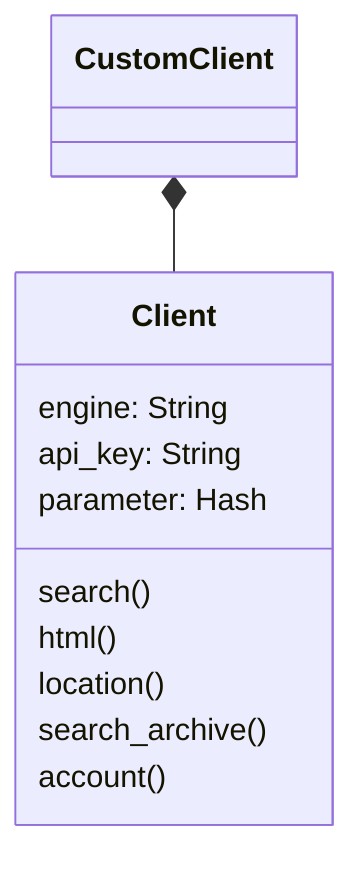
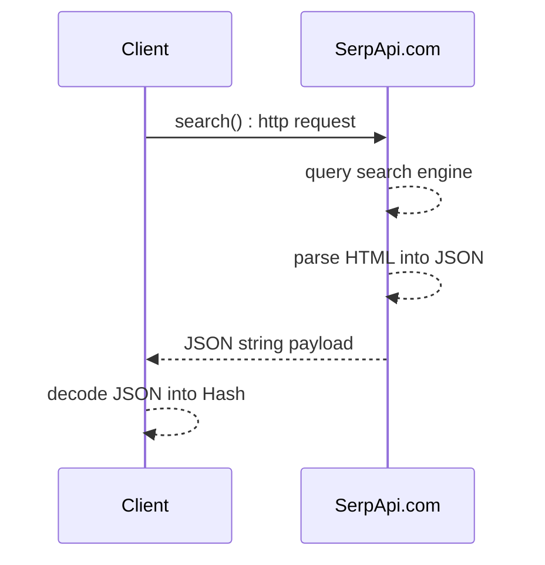

# Scrape Google and other search engines from our fast, easy, and complete API using SerpApi.com
#
[](https://github.com/serpapi/serpapi-ruby/actions/workflows/ci.yml)
[](https://badge.fury.io/rb/serpapi)

This Ruby Gem is meant to scrape and parse results from all major search engine available world wide including Google, Bing, Baidu, Yandex, Yahoo, Ebay, Apple and more using [SerpApi](https://serpapi.com).
SerpApi.com returns JSON or HTML results. This library does automatically convert JSON in Hash using the json standard library from shipped with Ruby.

SerpApi.com provides a [script builder](https://serpapi.com/demo) to get you started quickly.

## Installation

A modern version of Ruby must be already installed.

```bash
$ gem install serpapi
```

[Link to the gem page](https://rubygems.org/gems/serpapi/)

Tested Ruby versions:
 - 2.2
 - 2.5.2
 - 3.0.0

see: Git hub actions.

## Quick start

```ruby
require 'serpapi'
client = SerpApi::Client.new(engine: 'google', api_key: "secret_api_key")
results = client.search(q: "coffee")
pp results
 ```

This example runs a client about "coffee" using your secret api key 
 and get a result in dynamic Hash.

The SerpApi.com service (backend)
 - searches on Google using the client: q = "coffee"
 - parses the messy HTML responses
 - return a standardizes JSON response
The class SerpApi::Client
 - Format the request to SerpApi.com server
 - Execute GET http request
 - Parse JSON into Ruby Hash using JSON standard library provided by Ruby
Et voila..

See the [playground to generate your code.](https://serpapi.com/playground)

### Summary
- [Installation](#installation)
- [Quick start](#quick-start)
- [API Guide](#guide)
  - [Search API overview](#search-api-overview)
  - [Example by specification](#example-by-specification)
  - [Location API](#location-api)
  - [Search Archive API](#client-archive-api)
  - [Account API](#account-api)'
- [Basic example per search engine](#basic-example-per-search-engine)
  - [Search Google Images](#search-google-images)
- [Advanced search API usage](#advanced-search-api-usage)
  - [SerpApi client](#serpapi-client)
  - [Batch Asynchronous client](#batch-asynchronous-client)
- [Change log](#change-log)
- [Roadmap](#roadmap)
- [Conclusion](#conclusion)
- [Contributing](#contributing)

## API Guide

### Search API overview
```ruby
# initialize the client
client = SerpApi::Client.new(api_key: "private key")

# search query
query = {
  engine: "google", # full list: https://serpapi.com/search-api
  q: "client",
  google_domain: "Google Domain",
  location: "Location Requested", # example: Portland,Oregon,United States
  device: "desktop|mobile|tablet",
  hl: "Google UI Language",
  gl: "Google Country",
  safe: "Safe Search Flag",
  num: "Number of Results",
  start: "Pagination Offset",
  tbm: "nws|isch|shop",
  tbs: "custom to be client criteria"
  async: true|false # allow async call
}

# formated search results as a Hash
#  serpapi.com converts HTML -> JSON 
results = client.search(query)

# raw html as a String
#  serpapi.com acts a proxy to provive high throughputs
doc = client.html(query)
```

(The full documentation)[https://serpapi.com/client-api].
More hands on examples are available belows.


### Location API

```ruby
client = SerpApi::Client.new() 
location_list = client.location(q: "Austin", limit: 3)
puts "number of location: #{location_list.size}"
pp location_list
```

it prints the first 3 location matching Austin (Texas, Texas, Rochester)
```ruby
[{:id=>"585069bdee19ad271e9bc072",
  :google_id=>200635,
  :google_parent_id=>21176,
  :name=>"Austin, TX",
  :canonical_name=>"Austin,TX,Texas,United States",
  :country_code=>"US",
  :target_type=>"DMA Region",
  :reach=>5560000,
  :gps=>[-97.7430608, 30.267153],
  :keys=>["austin", "tx", "texas", "united", "states"]},
  ...]
```

### Search Archive API

This API allows to retrieve previous client.
To do so run a client to save a search_id.
```ruby
client = SerpApi::Client.new(api_key: ENV['API_KEY'], engine: 'google')
original_search = client.search(q: "Coffee", location: "Portland")
search_id = original_search[:search_metadata][:id]
```

Now let retrieve the previous client from the archive.

```ruby
client = SerpApi::Client.new(api_key: ENV['API_KEY'])
archive_results = client.search_archive(search_id)
pp archive_results
```
it prints the search results from archive.

### Account API
```ruby
client = SerpApi::Client.new(api_key: ENV['API_KEY'])
pp client.account
```
it prints your account information.

## Basic example per search engine

### Search bing
```ruby
require 'serpapi'
client = SerpApi::Client.new(api_key: ENV['API_KEY'], engine: 'bing')
results = client.search({
"q": "coffee"
})
pp results[:organic_results]
# ENV['API_KEY'] captures the secret user API available from http://serpapi.com
end
```
 see: spec/serpapi/example_search_bing_spec.rb
(see https://serpapi.com/bing)[https://serpapi.com/bing]

### Search baidu
```ruby
require 'serpapi'
client = SerpApi::Client.new(api_key: ENV['API_KEY'], engine: 'baidu')
results = client.search({
"q": "coffee"
})
pp results[:organic_results]
# ENV['API_KEY'] captures the secret user API available from http://serpapi.com
end
```
 see: spec/serpapi/example_search_baidu_spec.rb
(see https://serpapi.com/baidu)[https://serpapi.com/baidu]

### Search yahoo
```ruby
require 'serpapi'
client = SerpApi::Client.new(api_key: ENV['API_KEY'], engine: 'yahoo')
results = client.search({
"p": "coffee"
})
pp results[:organic_results]
# ENV['API_KEY'] captures the secret user API available from http://serpapi.com
end
```
 see: spec/serpapi/example_search_yahoo_spec.rb
(see https://serpapi.com/yahoo)[https://serpapi.com/yahoo]

### Search youtube
```ruby
require 'serpapi'
client = SerpApi::Client.new(api_key: ENV['API_KEY'], engine: 'youtube')
results = client.search({
"search_query": "coffee"
})
pp results[:video_results]
# ENV['API_KEY'] captures the secret user API available from http://serpapi.com
end
```
 see: spec/serpapi/example_search_youtube_spec.rb
(see https://serpapi.com/youtube)[https://serpapi.com/youtube]

### Search walmart
```ruby
require 'serpapi'
client = SerpApi::Client.new(api_key: ENV['API_KEY'], engine: 'walmart')
results = client.search({
"query": "coffee"
})
pp results[:organic_results]
# ENV['API_KEY'] captures the secret user API available from http://serpapi.com
end
```
 see: spec/serpapi/example_search_walmart_spec.rb
(see https://serpapi.com/walmart)[https://serpapi.com/walmart]

### Search ebay
```ruby
require 'serpapi'
client = SerpApi::Client.new(api_key: ENV['API_KEY'], engine: 'ebay')
results = client.search({
"_nkw": "coffee"
})
pp results[:organic_results]
# ENV['API_KEY'] captures the secret user API available from http://serpapi.com
end
```
 see: spec/serpapi/example_search_ebay_spec.rb
(see https://serpapi.com/ebay)[https://serpapi.com/ebay]

### Search naver
```ruby
require 'serpapi'
client = SerpApi::Client.new(api_key: ENV['API_KEY'], engine: 'naver')
results = client.search({
"query": "coffee"
})
pp results[:ads_results]
# ENV['API_KEY'] captures the secret user API available from http://serpapi.com
end
```
 see: spec/serpapi/example_search_naver_spec.rb
(see https://serpapi.com/naver)[https://serpapi.com/naver]

### Search home depot
```ruby
require 'serpapi'
client = SerpApi::Client.new(api_key: ENV['API_KEY'], engine: 'home_depot')
results = client.search({
"q": "table"
})
pp results[:products]
# ENV['API_KEY'] captures the secret user API available from http://serpapi.com
end
```
 see: spec/serpapi/example_search_home_depot_spec.rb
(see https://serpapi.com/home_depot)[https://serpapi.com/home_depot]

### Search apple app store
```ruby
require 'serpapi'
client = SerpApi::Client.new(api_key: ENV['API_KEY'], engine: 'apple_app_store')
results = client.search({
"term": "coffee"
})
pp results[:organic_results]
# ENV['API_KEY'] captures the secret user API available from http://serpapi.com
end
```
 see: spec/serpapi/example_search_apple_app_store_spec.rb
(see https://serpapi.com/apple_app_store)[https://serpapi.com/apple_app_store]

### Search duckduckgo
```ruby
require 'serpapi'
client = SerpApi::Client.new(api_key: ENV['API_KEY'], engine: 'duckduckgo')
results = client.search({
"q": "coffee"
})
pp results[:organic_results]
# ENV['API_KEY'] captures the secret user API available from http://serpapi.com
end
```
 see: spec/serpapi/example_search_duckduckgo_spec.rb
(see https://serpapi.com/duckduckgo)[https://serpapi.com/duckduckgo]

### Search google search
```ruby
require 'serpapi'
client = SerpApi::Client.new(api_key: ENV['API_KEY'], engine: 'google_search')
results = client.search({
"q": "coffee",
"engine": "google"
})
pp results[:organic_results]
# ENV['API_KEY'] captures the secret user API available from http://serpapi.com
```
 see: spec/serpapi/example_search_google_search_spec.rb
(see https://serpapi.com/google_search)[https://serpapi.com/google_search]

### Search google scholar
```ruby
require 'serpapi'
client = SerpApi::Client.new(api_key: ENV['API_KEY'], engine: 'google_scholar')
results = client.search({
"q": "coffee"
})
pp results[:organic_results]
# ENV['API_KEY'] captures the secret user API available from http://serpapi.com
end
```
 see: spec/serpapi/example_search_google_scholar_spec.rb
(see https://serpapi.com/google_scholar)[https://serpapi.com/google_scholar]

### Search google autocomplete
```ruby
require 'serpapi'
client = SerpApi::Client.new(api_key: ENV['API_KEY'], engine: 'google_autocomplete')
results = client.search({
"q": "coffee"
})
pp results[:suggestions]
# ENV['API_KEY'] captures the secret user API available from http://serpapi.com
end
```
 see: spec/serpapi/example_search_google_autocomplete_spec.rb
(see https://serpapi.com/google_autocomplete)[https://serpapi.com/google_autocomplete]

### Search google product
```ruby
require 'serpapi'
client = SerpApi::Client.new(api_key: ENV['API_KEY'], engine: 'google_product')
results = client.search({
"q": "coffee",
"product_id": "4172129135583325756"
})
pp results[:product_results]
# ENV['API_KEY'] captures the secret user API available from http://serpapi.com
```
 see: spec/serpapi/example_search_google_product_spec.rb
(see https://serpapi.com/google_product)[https://serpapi.com/google_product]

### Search google reverse image
```ruby
require 'serpapi'
client = SerpApi::Client.new(api_key: ENV['API_KEY'], engine: 'google_reverse_image')
results = client.search({
"image_url": "https://i.imgur.com/5bGzZi7.jpg"
})
pp results[:image_sizes]
# ENV['API_KEY'] captures the secret user API available from http://serpapi.com
end
```
 see: spec/serpapi/example_search_google_reverse_image_spec.rb
(see https://serpapi.com/google_reverse_image)[https://serpapi.com/google_reverse_image]

### Search google events
```ruby
require 'serpapi'
client = SerpApi::Client.new(api_key: ENV['API_KEY'], engine: 'google_events')
results = client.search({
"q": "coffee"
})
pp results[:events_results]
# ENV['API_KEY'] captures the secret user API available from http://serpapi.com
end
```
 see: spec/serpapi/example_search_google_events_spec.rb
(see https://serpapi.com/google_events)[https://serpapi.com/google_events]

### Search google local services
```ruby
require 'serpapi'
client = SerpApi::Client.new(api_key: ENV['API_KEY'], engine: 'google_local_services')
results = client.search({
"q": "Electrician",
"place_id": "ChIJOwg_06VPwokRYv534QaPC8g"
})
pp results[:local_ads]
# ENV['API_KEY'] captures the secret user API available from http://serpapi.com
```
 see: spec/serpapi/example_search_google_local_services_spec.rb
(see https://serpapi.com/google_local_services)[https://serpapi.com/google_local_services]

### Search google maps
```ruby
require 'serpapi'
client = SerpApi::Client.new(api_key: ENV['API_KEY'], engine: 'google_maps')
results = client.search({
"q": "pizza",
"ll": "@40.7455096,-74.0083012,15.1z",
"type": "search"
})
pp results[:local_results]
```
 see: spec/serpapi/example_search_google_maps_spec.rb
(see https://serpapi.com/google_maps)[https://serpapi.com/google_maps]

### Search google jobs
```ruby
require 'serpapi'
client = SerpApi::Client.new(api_key: ENV['API_KEY'], engine: 'google_jobs')
results = client.search({
"q": "coffee"
})
pp results[:jobs_results]
# ENV['API_KEY'] captures the secret user API available from http://serpapi.com
end
```
 see: spec/serpapi/example_search_google_jobs_spec.rb
(see https://serpapi.com/google_jobs)[https://serpapi.com/google_jobs]

### Search google play
```ruby
require 'serpapi'
xit 'prints organic_results' do
client = SerpApi::Client.new(api_key: ENV['API_KEY'], engine: 'google_play')
results = client.search({
"q": "kite",
"store": "apps"
})
pp results[:organic_results]
```
 see: spec/serpapi/example_search_google_play_spec.rb
(see https://serpapi.com/google_play)[https://serpapi.com/google_play]

### Search google images
```ruby
require 'serpapi'
client = SerpApi::Client.new(api_key: ENV['API_KEY'], engine: 'google_images')
results = client.search({
"engine": "google",
"tbm": "isch",
"q": "coffee"
})
pp results[:images_results]
```
 see: spec/serpapi/example_search_google_images_spec.rb
(see https://serpapi.com/google_images)[https://serpapi.com/google_images]

## Advanced search API usage
### Batch Asynchronous client

Search API enables to search `async`.
 - Non-blocking - async=true : more complex code but 
 - Blocking - async=false - it's more compute intensive because the client would need to hold many connections.

```ruby
# target MAANG companies
company_list = %w(meta amazon apple netflix google)
client = SerpApi::Client.new({async: true, api_key: "secret_api_key"})
search_queue = Queue.new
company_list.each do |company|
  # set client
  client.parameter[:q] = company

  # store request into a search_queue - no-blocker
  result = client.search()
  if result[:search_metadata][:status] =~ /Cached|Success/
    puts "#{company}: client done"
    next
  end

  # add result to the client queue
  search_queue.push(result)
end

puts "wait until all searches are cached or success"
client = SerpApi::Client.new
while !search_queue.empty?
  result = search_queue.pop
  # extract client id
  search_id = result[:search_metadata][:id]

  # retrieve client from the archive - blocker
  search_archived = client.search_archive(search_id)
  if search_archived[:search_metadata][:status] =~ /Cached|Success/
    puts "#{search_archived[:search_parameters][:q]}: client done"
    next
  end

  # add result to the client queue
  search_queue.push(result)
end

search_queue.close
puts 'all searches completed'
  ```
This code shows a simple implementation to run a batch of asynchronously searches.

## Change log
 * [2022-03-20] 1.0.0 Full API support

## Developer's note
### Key goals
 - Brand centric instead of search engine based
   - No hard coded logic per search engine
 - Simple HTTP client (lightweight, reduced dependency)
   - No magic default values
   - Thread safe
 - Easy to extends
 - Defensive code style (raise cutsom exception)
 - TDD
 - Best API coding pratice per platform

### Design
To write this Ruby code we learn from the most favous Ruby available on rubygems.
 - Nokogiri
 - Cloudfare
 - rest-client\
 
### Quality expectation
 - 0 lint issues using pylint `make lint`
 - 99% code coverage running `make test`

# Developer Guide
## Design : UML diagram

## search() : Sequence diagram

## Continuous integration
We love true open source, continuous integration and Test Drive Development (TDD).
 We are using RSpec to test [our infrastructure around the clock]) using github action in order to achieve the best QoS (Quality Of Service).

The directory spec/ includes specification which serves dual purpose of examples and functional tests.

Set your api key to allow the tests to run.
```bash
export API_KEY="your secret key"
```

Install testing dependency
```bash
bundle install
```

Check code quality using lint 
```bash
rake lint
```

Run regression
```bash
rake test
```
Contributions are welcome, feel to submit a pull request!

# TODO
 - [] Release
 - [] code coverage
 - [] CI integration